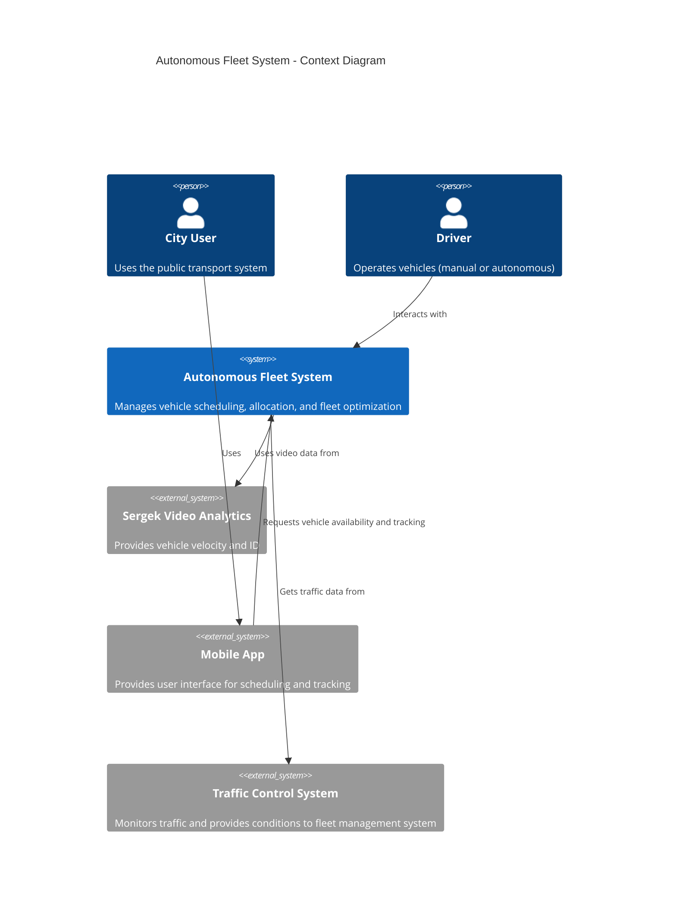

# Autonomous Fleet Management and Optimization System

## 1. Abstract

This system integrates autonomous buses into an existing public transportation infrastructure to dynamically optimize vehicle allocation, routes, and schedules. It adapts to real-time passenger demand, traffic conditions, and vehicle availability—significantly reducing operational inefficiencies and enhancing passenger experience.

## 2. Requirements

### Functional
- Real-time dynamic scheduling and vehicle routing.
- Autonomous and traditional vehicle integration.
- Public-facing interface for route tracking.
- Admin control interface with override ability.

### Non-Functional
- **Safety-critical**: Prevent collisions, system faults.
- **Availability**: ≥ 99.99% uptime.
- **Latency**: Sub-100ms for vehicle control.
- **Scalability**: Up to 1M vehicle nodes.
- **Consistency**: Strong sync between services.

## 3. Modeling

### External Systems
- **Sergek** – Video analytics for vehicle speed/ID.
- **Third-party APIs** – Traffic, weather.

### Users
- **Commuters** – Use app for live bus info.
- **Transit Operators** – Dashboard for monitoring & overrides.
- **Autonomous Vehicles** – Send location data, receive control commands.

### Environment
- Population: ~2M, mostly in suburbs.
- Terrain: Mix of flat and minor mountainous areas.
- Transport: 1M vehicles, 10-minute average public bus interval.

---

## 4. Hardware Components

### Network Infrastructure
- **5G Edge Routers** – For real-time vehicle data transmission.
- **IoT Gateways** – Data pipe between suburban buses and HQ.
- **Access Points** – Installed at transport hubs.

### Servers
- **Edge Datacenter Cluster**
  - 5 x 64-core, 512GB RAM nodes
  - 20TB SSD for high-speed streaming data
- **Cloud Deployment (AWS/Azure)**
  - Autoscaling Kubernetes, multi-region
  - GPU-backed compute for ML inference

---

## 5. Architecture

> **See these visual references to draw C4 diagrams:**
- [Context & Container Diagram](https://chat.openai.com/share/3a11d117-b0b4-44a3-a47c-77f9d4573801)
- [Stream + Edge View](https://chat.openai.com/share/2b7312aa-9fbd-42fc-86cf-3b58e6a42725)
- [Cloud Service Layout](https://chat.openai.com/share/479ec0e7-674e-41d1-b52c-07a0ad3dd89c)

### C4 Model Summary

#### Level 1 – Context
- Commuters ↔ Mobile/Web UI
- Operators ↔ Admin Dashboard
- Vehicles ↔ Telemetry & Control API
- Sergek ↔ Sensor Event Ingestor

#### Level 2 – Container
- `Mobile/Web App` – Frontend for users
- `API Gateway` – Access point to backend services
- `Scheduler Service` – Adjusts fleet based on demand
- `Vehicle Command Service` – Sends low-latency instructions
- `Telemetry Processor` – Processes Kafka stream
- `Frontend Dashboard` – Control panel for operators
- `Data Platform`: PostgreSQL + Kafka + Redis + S3

#### Level 3 – Component (Example: Scheduler Service)
- `Demand Forecaster` – ML-based prediction
- `Route Optimizer` – Real-time dynamic rerouting
- `Vehicle Allocator` – Picks best-fit vehicle
- `Safety Validator` – Ensures system constraints
- `Incident Monitor` – Logs anomalies and notifies operators

---

## 6. Technology Stack

### Backend
- **Go / Rust** – High-performance services
- **Python** – ML and predictive modules
- **Node.js** – API layer

### Data
- **PostgreSQL** – Long-term route and metadata
- **Apache Kafka** – Event stream from sensors and telemetry
- **Apache Flink** – Real-time stream processor
- **Redis** – Real-time vehicle cache
- **Amazon S3 / Azure Blob** – Archive of historical data

### Communication
- **gRPC** – Low-latency control to autonomous vehicles
- **MQTT** – Lightweight telemetry protocol
- **HTTPS/REST** – App and admin service integration

### Infra
- **Kubernetes** – Service orchestration
- **Prometheus + Grafana** – Monitoring
- **ELK Stack** – Logs and auditing
- **Cloud Provider** – AWS/Azure (multi-region)

---

# Data Infrastructure Blueprint for Autonomous Fleet System

## 1. Ingestion Layer

**Components:**
- MQTT Broker (e.g., EMQX, Mosquitto)
- REST / WebSocket Gateways
- Kafka Connect

**Data Sources:**
- Vehicle Telemetry (speed, location, battery, etc.)
- Sergek video analytics data (vehicle ID, velocity)
- Mobile App (user location, booking info)

## 2. Stream Processing Layer

**Components:**
- Apache Kafka (stream buffer)
- Apache Flink or Kafka Streams (processing)
- Redis Streams / MQTT Bridge (control signal dispatcher)

**Processing Tasks:**
- Real-time route adaptation
- Demand heatmap generation
- Predictive scheduling

## 3. Operational Data Store

**Technologies:**
- Redis (vehicle state caching)
- PostgreSQL with PostGIS / CockroachDB (routing decisions)

**Use Cases:**
- Real-time schedule lookups
- Location-to-vehicle mapping

## 4. Analytical Data Store

**Storage:**
- Amazon S3 / Azure Data Lake (raw telemetry, logs)
- ClickHouse or BigQuery (aggregated data)

**ETL & ML:**
- Apache Airflow (orchestration)
- MLflow + MinIO (model store and retrieval)

## 5. Metadata & Quality

**Tools:**
- Confluent Schema Registry (Kafka messages)
- Apache Atlas / Amundsen (cataloging)
- Great Expectations (data validation)
- OpenLineage (data lineage tracking)

## 6. Communication Flow


## 7. Data Flow

```plaintext
[Sensors, Sergek, GPS] 
    ↓ 
[Kafka Topics] 
    → [Flink] → [Redis / PostgreSQL]
    → [Scheduler] → [Route Optimizer]
    → [Vehicle Command Service] → [Autonomous Vehicles]
    → [Frontend Services] → [User Apps / Operator Dashboard]




```mermaid
C4Container
    title Autonomous Fleet System - Container Diagram

    Container(webApp, "Web App", "React/Vue", "Allows users to interact with the system for scheduling and monitoring")
    Container(backendAPI, "Backend API", "Node.js / Flask / Django", "Handles scheduling, vehicle allocation, and interactions")
    Container(database, "Database", "PostgreSQL / CockroachDB", "Stores vehicle data, schedules, and user information")
    Container(kafka, "Kafka", "Apache Kafka", "Streams real-time telemetry and control messages")
    Container(flux, "Stream Processor", "Apache Flink / Spark", "Processes data streams for route prediction and vehicle state management")
    Container(externalAPI, "External API Gateway", "Kong / NGINX", "Handles external API calls and secures interactions")

    Rel(customer, webApp, "Interacts with")
    Rel(webApp, backendAPI, "Calls REST API")
    Rel(backendAPI, database, "Reads/Writes data to")
    Rel(backendAPI, kafka, "Streams control commands")
    Rel(kafka, flux, "Streams data for processing")
    Rel(flux, database, "Updates processed data to")
    Rel(externalAPI, transportSystem, "Provides external access for third-party services")

```