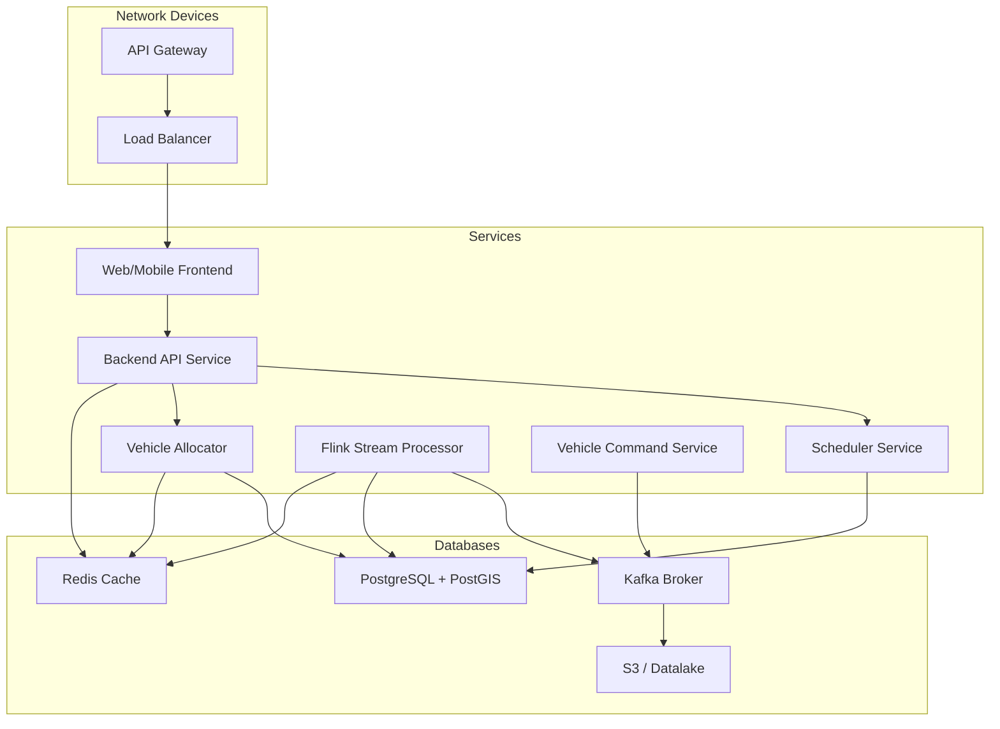
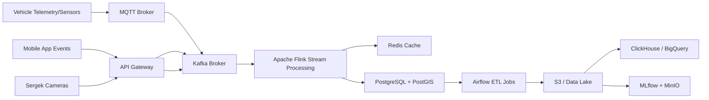
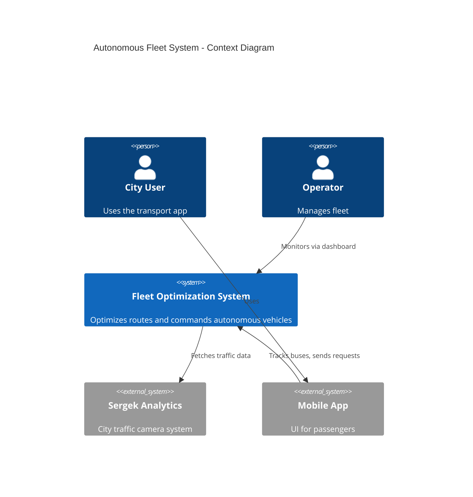
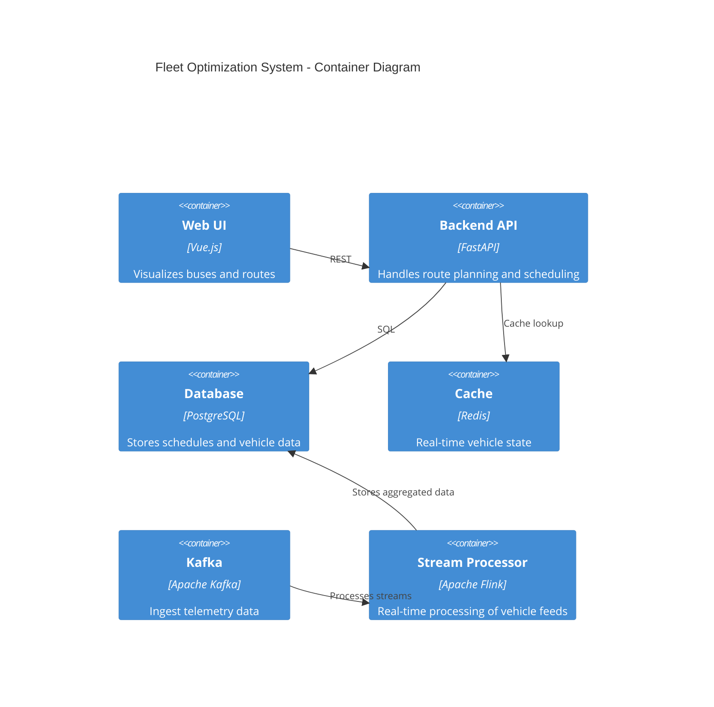
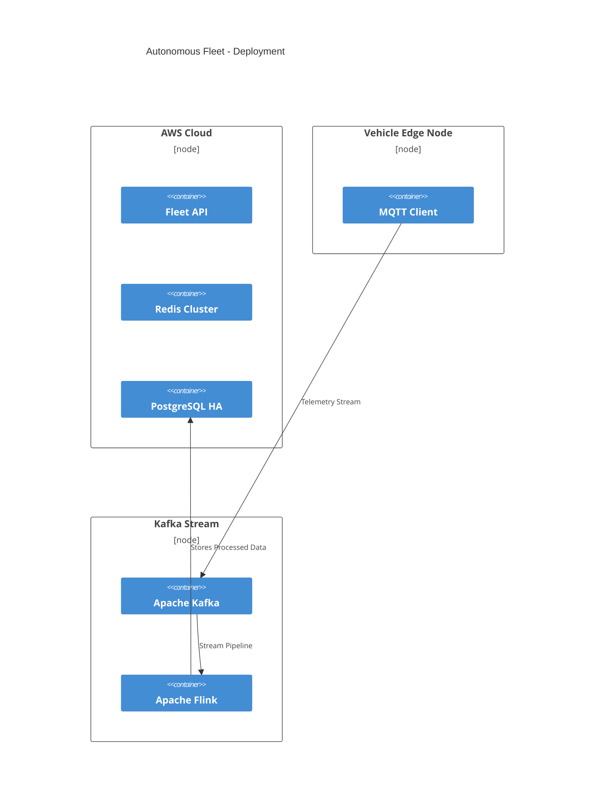

# Data Infrastructure Blueprint for Autonomous Fleet System

## 1. System Overview and Scope

The Autonomous Fleet System is a distributed software system that dynamically manages electric and self-driving public transit vehicles within a suburban city environment. It helps optimize fleet allocation, route planning, and scheduling based on real-time data such as demand, traffic, and vehicle status. The primary users include commuters, transit operators, and autonomous vehicle nodes.

**In Scope:**
- Dynamic scheduling and routing
- Real-time telemetry ingestion and command dispatch
- Public-facing apps (passenger tracking)
- Operator dashboard (monitor & control)

**Out of Scope:**
- In-vehicle low-level navigation stack
- Payments and fare collection

## 2. Functional and Non-Functional Requirements

### Functional:
- Monitor vehicle telemetry and location
- Adjust vehicle schedule dynamically
- Send optimized commands to autonomous vehicles
- Visual dashboards for users and operators

### Non-Functional:
- Scalability: handle 1000+ vehicles and millions of events/day
- Security: end-to-end TLS, encrypted storage
- Latency: sub-second response for critical services
- Reliability: 99.99% uptime for control services

## 3. High-Level Architecture

- Components: Web app, Backend APIs, Kafka Stream, Redis, PostgreSQL, ML model runner
- Services communicate via REST, MQTT, gRPC, and Kafka topics

Data Infrastructure

## 4. Component Breakdown

| Component            | Responsibilities                                                | Tech Stack               |
|---------------------|------------------------------------------------------------------|--------------------------|
| Web & Mobile App     | Display buses, allow route queries                              | Vue.js, REST, HTTPS      |
| API Gateway          | Secure routing to services, rate-limiting                       | Kong, TLS, JWT OAuth     |
| Scheduler Service    | Route planning based on traffic, demand                         | Python, PostGIS, Redis   |
| Vehicle Command Svc  | Issues commands to buses                                        | Go, MQTT, Redis Streams  |
| Stream Processor     | Real-time data aggregation from sensors                         | Kafka, Flink             |
| Sergek Adapter       | Ingests video data from external systems                        | Kafka Connect, Webhooks  |

## 5. Data Storage and Database Schema

- **Redis**: Caching for live vehicle state and ETA
- **PostgreSQL + PostGIS**: Route graphs, schedules, event logs
- **Kafka**: Event streaming (telemetry, control feedback)
- **S3/ClickHouse**: Long-term telemetry analytics
- **Schema**: Vehicles(id, type, location, battery); Routes(id, path, stops, traffic)

## 6. Technology Stack and Justification

| Layer               | Tech                 | Reason                                        |
|--------------------|----------------------|-----------------------------------------------|
| Frontend            | Vue.js               | Lightweight and fast user-facing app          |
| Backend API         | FastAPI / Flask      | Async capabilities, quick dev cycle           |
| Stream              | Apache Kafka + Flink | Real-time, fault-tolerant streaming           |
| Database            | PostgreSQL + Redis   | Strong consistency, geospatial queries        |
| Cloud/Infra         | AWS + Kubernetes     | Scalable, managed, multi-region support       |
| CI/CD               | GitHub Actions       | Fast deploy pipeline                          |
| Monitoring          | Prometheus + Grafana | Real-time alerts and metrics dashboard        |

## 7. Scalability, Security, Reliability

### Scalability:
- Kafka + Flink support distributed stream processing
- Stateless services behind load balancers
- Redis & Postgres with sharding or clustering as needed

### Security:
- HTTPS everywhere (TLS 1.3)
- OAuth2.0/JWT for user & service auth
- MQTT with client certs for vehicle comms
- Secrets stored in Vault or AWS Secrets Manager

### Reliability:
- Kafka ensures event durability
- PostgreSQL high-availability clusters
- Retry queues and circuit breakers for command delivery
- Cloud-based auto-scaling

## 8. Trade-Offs and Limitations

| Decision                  | Trade-Off                                                       |
|--------------------------|------------------------------------------------------------------|
| Real-time edge compute   | Increased complexity but better latency                          |
| Event streaming          | More infra to manage vs simple REST calls                        |
| Relational DB over NoSQL | Better data integrity, but harder horizontal scaling             |
| External traffic ingest  | Relies on 3rd-party data uptime and integrity                    |
| MQTT for telemetry       | Efficient but limited to small payloads, not great for bulk data |

## 9. C4 Architecture Diagrams (Mermaid.js)

### Context Diagram

### Container Diagram

### Deployment Diagram

